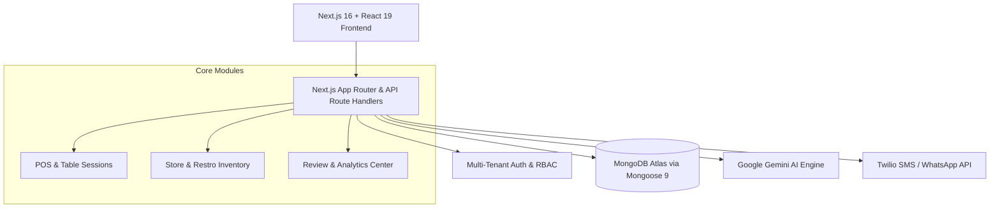

# 🍽️ RestroManager — Full-Stack AI-Powered Restaurant ERP & POS Platform

[](https://nextjs.org/)
[](https://react.dev/)
[](https://www.typescriptlang.org/)
[](https://www.mongodb.com/)
[](https://ai.google.dev/)

> **RestroManager** is a next-generation Restaurant Management, POS, and Analytics SaaS platform built with Next.js App Router, TypeScript, and MongoDB. It features real-time billing, multi-store inventory management, table session lifecycles, customer loyalty tracking, dynamic QR digital receipts, and an embedded Google Gemini AI business analytics assistant.

---

## ✨ Features

- **⚡ Real-Time POS & Billing**: Ultra-fast live table ordering, KOT (Kitchen Order Ticket) dispatch, dynamic bill generation, and split payments.
- **🤖 Embedded Gemini AI Copilot**: Ask conversational questions about revenue trends, sales velocity, dish popularity, inventory waste, and margin optimization.
- **📊 Comprehensive Analytics**: Live interactive revenue dashboards powered by Recharts (daily sales, peak hours, customer retention).
- **📦 Multi-Location Inventory & Stock Alerts**: Real-time ingredient deductions, batch tracking, cost-of-goods calculation, and automated low-stock warnings.
- **📱 QR Code Digital Invoicing**: Instant printable and mobile-friendly QR receipts for diners via `qrcode.react`.
- **⭐ Customer Feedback & Review Intelligence**: Automated review ingestion, satisfaction sentiment analysis, and alert triggers for low ratings.
- **🔒 Multi-Tenant Auth & Role-Based Access**: Granular permission control for Admins, Cashiers, Kitchen Staff, and Store Owners.

---

## 🏗️ Architecture & Component Flow



---

## 🛠️ Tech Stack

| Domain | Technology |
|---|---|
| **Framework** | Next.js 16 (App Router), React 19 |
| **Language** | TypeScript 5 |
| **Styling & Motion** | Vanilla CSS Modules, Tailwind CSS, Framer Motion |
| **Database & ODM** | MongoDB, Mongoose 9.x |
| **AI Integration** | Google Generative AI SDK (`@google/generative-ai` / Gemini Pro) |
| **Visualizations** | Recharts, Lucide React Icons |
| **Communications & Utility** | Twilio, QRCode.react, Date-fns |

---

## 🚀 Getting Started

### 1. Prerequisites
- Node.js 20.x or higher
- MongoDB instance (Local or Atlas)
- Google Gemini API Key

### 2. Installation
```bash
# Clone the repository
git clone https://github.com/Harshxu/RestroManager.git
cd RestroManager

# Install dependencies
npm install
```

### 3. Environment Variables
Create a `.env.local` file:
```env
MONGODB_URI=mongodb+srv://<username>:<password>@cluster.mongodb.net/restro_db
GEMINI_API_KEY=your_gemini_api_key_here
NEXT_PUBLIC_APP_URL=http://localhost:3000
TWILIO_ACCOUNT_SID=your_twilio_sid
TWILIO_AUTH_TOKEN=your_twilio_token
```

### 4. Run Development Server
```bash
npm run dev
```
Open [http://localhost:3000](http://localhost:3000) to view the application.
